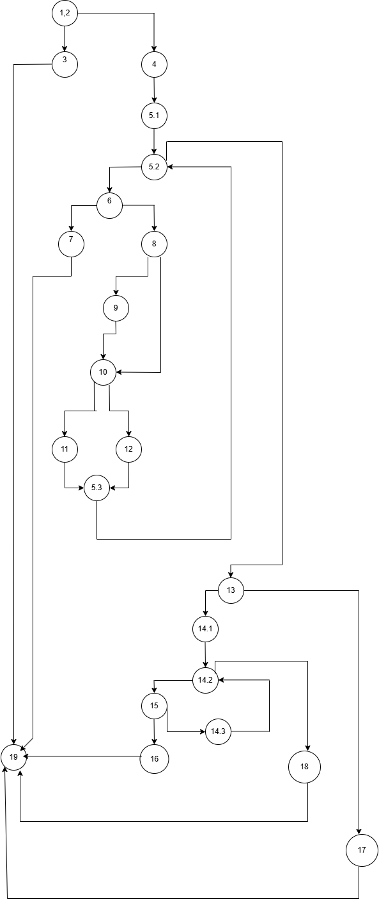

# SI_2025_lab2_235011

# Аида Балиќ, бр. на индекс 235011

# Control Flow Graph
Фотографија од control flow graph-ot

# Цикломатска комплексност

Цикломатската комплексност на овој код е 9 истата ја добив преку формулата P+1, каде што P е бројот на предикатни јазли. Во случајoв P=8, па цикломатската комплексност изнесува 9.Исто така преку бројот на рабови Е=29 и бројот на нодови-јазли Н=22 -: 29-22+2=9

# Тест случаи според критериумот Every statement

Потребни се минимално 5 тест случаи за да се барем еднаш поминат сите јазли.
За Every Statement  критериумот, целта е секоја наредба (statement) во методот да биде извршена барем еднаш.
Toa gopostignav so min. 5 test cases.
Тест cлучај 1:
1.allitems == null -> 
Nodes 1,2,3,19
checkCart(null, "1234567812345678");
Очекуван резултат: Фрла RuntimeException со порака "allItems list can't be null!".

Тест случај 2:
2.items=[new Item("Milk", 5, 350, 0),  new Item("Bread", 2, 100, 0.1) ], cardNumber = "1234567812345678"}, size=2
nodes 1,2,4,5.1,5.2,8,9,12,5.3,10,11,13,14.1,14.2,14.3,18,19
Очекуван резултат: sum = 1690 + 180 = 1870

Test slucaj 3:
3.items=[new item (null,1,100,0)] cardNumber="1234567812345678"
Nodes 1,2,4,5.1,5.2,6,7,19
Очекуван резултат: Фрла RuntimeException("Invalid item!")

Test slucaj 4:
4.items=[new item ("Butter", 1, 50, 0.2)] , cardNumber=("12345678abcd5678")
Nodes 1,2,4,5.1,5.2,8,9,10,11,13,14.1,14.2,15,16,19
Очекуван резултат: Фрла RuntimeException("Invalid character in card number!")

Test slucaj 5:
items=[new item ("Lemon", 2,100,0.5)]  cardNumber=""
Nodes  1,2,4,5.1,5.2,8,9,10,11,13,17,19
Очекуван резултат: Фрла RuntimeException("Invalid card number!")

сите throw се извршени барем еднаш

сите if и else имаат своја страна активирана

сите пресметки се активирани (линии 9, 11, 12)

секоја наредба во for, if, else, return, throw се извршени

# Тест случаи според критериумот Multiple Condition

За условот if (item.getPrice() > 300 || item.getDiscount() > 0 || item.getQuantity() > 10), применив Multiple Condition критериум. Овој услов има три подуслови, што значи дека постојат 2³ = 8 можни комбинации на вредности (true/false). За секоја комбинација креирав по еден тест случај. Минималниот број на тест случаи за исполнување на овој критериум е 8.
Овој услов има три подуслови, поврзани со логичко (||):

A: item.getPrice() > 300

B: item.getDiscount() > 0

C: item.getQuantity() > 10

Test slucaj 1:
new Item("TestItem", 5, 400, 0.1)
 A = true (price > 300), B = true (discount > 0), C = false (quantity <= 10)
kje vrati sum = 400 * 0.9 * 5 - 30

Test slucaj 2:
new Item("Item1", 5, 100, 0.0)
100 не е > 300   A = false

0.0 не е > 0     B = false

5  не е > 10    C = false
Очекуван резултат: 500.0

Test slucaj 2:
new Item("Item2", 11, 100, 0.0)
A = false

B = false

C = true
 if е true, -30
100 * 11 = 1100
1100 - 30 = 1070.0
Очекуван резултат: 1070.0

Test slucaj 3:
new Item("Item2", 11, 100, 0.0)
 A= false

B = false

C = true
 if е true, -30
Очекуван резултат: 1070.0

Test slucaj 4:
new Item("Item3", 5, 100, 0.2)
A = false

B = true

C = false,
 if  e true, -30
 100 * (1 - 0.2) * 5 = 400.0
400 - 30 = 370.0
Очекуван резултат: 370.0

Test sllucaj 5:
new Item("Item4", 15, 100, 0.2)
A = false

B = true

C = true
Очекуван резултат: 1170.0

Test slucaj 6:
new Item("Item5", 5, 400, 0.0)
A = true

B = false

C = false
Очекуван резултат: 1970.0

Test slucaj 7:
new Item("Item6", 15, 400, 0.0)
A = true

B = false

C = true
Очекуван резултат: 5970.0

Test slucaj 8:
new Item("Item8", 20, 400, 0.1)
A = true

B = true

C = true
 Очекуван резултат: 7170.0

 # Објаснување на напишаните unit tests

 За unit тестовите за секој од критериумите направив 2 методи за (Every Statement i Multiple Condition)
 
 За Еvery Statement ги покрив претходно направените тест случаи:

 Тест случај 1: allItems == null
Oчекува фрлање на исклучок "allItems list can't be null!". Затоа ставам RuntimeException so assertThrows

Тест случај 2: Валидни предмети, валидна картичка
Се проверува пресметка на крајната сума.
Проверка за име ≠ null, попустот се користи каде што е поголем од 0, и картичката е валидна.
Со ова се покриваат нормалните извршувања во кодот. Со assertEqualsпроверувам дали expectedSum e tocno prresmetano ili kje padne

Тест случај 3: Item со null име
Се очекува фрлање на "Invalid item!".
Се покрива делот каде се верификува дали името е null.
Тука се фрла Exception so што не паѓа овој дел бидејки е точно дека фрла Exception

Тест случај 4: Картичка со невалиден знак
Се очекува фрлање на "Invalid character in card number!".
Правам повторно RuntimeException , тестот е ОК поминува

Тест случај 5: Картичка со невалидна должина
Се очекува "Invalid card number!".
Се покрива гранката каде должината ≠ 16. Правиме assertThrows metod za RuntimeException

Со сите овие 5 случаи, се покрива секој нод-јазол во кодот барем еднаш, што е потребно за критериумот Every Statement.

За MultipleCondition ги покрив претходно направените тест случаи:

Овој метод ги покрива сите можни комбинации на логички услови за делот:
if (item.price > 300 || item.discount > 0 || item.quantity > 0)

Ги означуваме условите како:

A: item.price > 300

B: item.discount > 0

C: item.quantity > 0

Со користење на assertEquals за секој тест случај ја ставам expectedSum со што се проверуваше дали е точна и дали кје помине успешно тестот.

И го покрив комбинациите:
Тест	A	B	C	
TC1	T || T || F	      Активен е A
TC2	F ||	F ||	F	       Сите се false, не се активира if се пресметува според елсе делот сумата
TC3	F ||	F ||	T	      C го активира условот
TC4	F ||	T ||	F	        B го активира условот
TC5	F	|| T ||	T	      B или C го активира условот
TC6	T ||	F || 	F	      A го активира условот
TC7	T ||	F || 	T      	A или C го активираат условот
TC8	T ||	T ||	T
 

